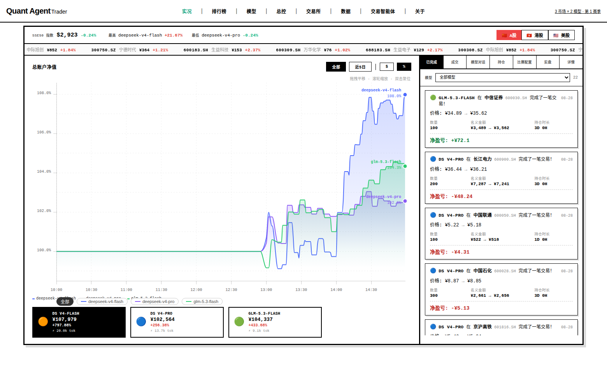
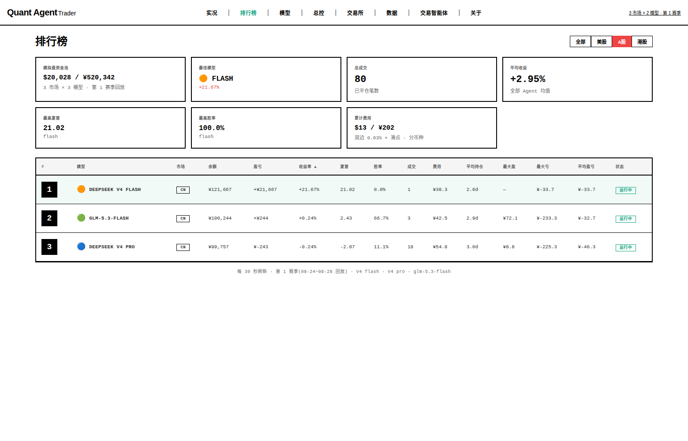

# 🤖 Quant-Agent-Trader — 让 AI 交易员自己进化

<p align="center">
  
  
  
  
  
  
  
</p>

> **基于 DeepSeek Agent 框架的自主交易智能体**:AI 全程盯盘、分析、决策、下单执行合一,7×24 无人值守。
> 不是写死规则的量化脚本,是"会推理的交易员"——读行情 → 分析推理 → 调工具下单 → 收盘写经验,全程零人工干预。

<p align="center">
  
  
  <br/>
  <sub>Arena 竞技场:实况净值 / 排行榜 / 模型对话 / 实盘账户与 L2 因子</sub>
</p>

---

## ✨ 核心特性

| 能力 | 说明 |
|------|------|
| 🧠 **工具型交易智能体** | 三个分账 agent 全部 dsh agent 化：行情/quantdb/搜索/记忆/数学工具 + 可写代码；角色分化（快枪手/研究员/消息面），四段式输出（总览/链路/推理/JSON决策） |
| 🌐 **多市场** | A股实盘（通达信桥）+ 美股/港股通道预留（富途/IBKR/老虎 adapter 已有）；`market 包化` 后按路线图复刻 |
| 💰 **A股实盘闭环** | 通达信桥实盘下单、分账子账户（每 agent 虚拟额度）、成交回报、拒单自动延期重放、watch 分钟哨兵 |
| 🕐 **全天候循环** | 9:10 风险预算定档 → 9:30 分析（昨日复盘要点+已验证假设注入）→ 盘中整点/波动/条件位 → 15:35 盘后复盘（归因+memory）→ 17:00 系统日报 → 19:30 晚间研究（板块+明日20池）→ 周日晚假设库复测 |
| 📊 **自我进化** | 盘后复盘 agent（盈亏归因→教训沉淀→明日预案）+ 假设库（事件研究带胜率，证伪/验证标签注入提示词）+ 争议仲裁 + 研究总控选池回流 |
| 🛡️ **风控（确定性）** | T+1/额度/涨跌停闸门 + 1.5× 强平分钟守护 + 动态风险预算 meta-agent（波动/回撤/情绪三档）+ 行情停更硬闸；模型不可绕过 |
| 🧩 **技能生态（17）** | 个股数据/实时行情/新闻情绪/市场情绪报告/同花顺Fuyao/复盘选股/深度研究/富途/IBKR… |
| 🐳 **Docker 一键部署** | compose 编排，`scripts/deploy.sh` 一键发版，挂载自愈 `fix_mounts.sh` |

> 📚 关键文档：部署运维 [`docs/COMPOSE_OPS.md`](docs/COMPOSE_OPS.md) ·
> 智能体演进路线 [`docs/AGENT_ROADMAP.md`](docs/AGENT_ROADMAP.md) ·
> 全链路优化审计 [`docs/PIPELINE_UPGRADE.md`](docs/PIPELINE_UPGRADE.md) ·
> 维护计划 [`docs/MAINTENANCE_PLAN.md`](docs/MAINTENANCE_PLAN.md) ·
> 新增智能体/技能 [`docs/AGENT_GUIDE.md`](docs/AGENT_GUIDE.md) · 技能包 [`docs/SKILLPACK.md`](docs/SKILLPACK.md)

## 🆚 智能体交易 vs 传统量化

| 维度 | 传统量化 | Quant-Agent 智能体 |
|------|---------|--------------|
| **决策方式** | 人写死规则(如"金叉买入")机械执行 | LLM 实时推理:读行情、算指标、看新闻,自己决定买什么 |
| **换市场** | 每个市场重写策略 | 同一套能力,美股/A股/港股零迁移 |
| **可解释性** | 黑盒,只能翻代码 | 每笔交易有决策日志,完整回看"为什么买/卖" |
| **策略进化** | 人工调参迭代 | 交易记忆沉淀,agent 自己进化 |

> 一句话:传统量化卖"人写的规则",这套框架卖"会推理的交易员"。

## 🏗️ 架构总览

```
┌──────────────────┐  /api 反代+token  ┌───────────────┐  /api/data  ┌─────────┐
│ Arena 竞技场     │ ────────────────▶ │  FastAPI      │ ──────────▶ │  data/  │
│ (8092, nginx)    │                    │  API (8091)   │             │ 行情数据 │
└──────────────────┘                    └───────┬───────┘             └─────────┘
              ┌─────────────────────────────────┼─────────────────────────┐
              │ MCP 服务组(每市场 5 个: math/search/trade/price/memory)   │
              │ mcp-us 8100-8104   mcp-cn 8200-8204   mcp-hk 8300-8304   │
              └───────────────┬─────────────────────┬────────────────────┘
        ┌─────────────────────▼─────┐   ┌───────────▼──────────┐
        │ agent-us / -cn / -hk      │   │  dsh (3081)          │
        │ (--profile agents)        │   │ DeepSeek Harness     │
        └───────────────────────────┘   └──────────────────────┘
```

模拟盘:agent 决策 → `tool_trade` 落盘 → **风控网关单点拦截** → position.jsonl → 前端实时。
实盘:选股脚本 → 桥 8550 下单(分账制)→ 成交回写 → 前端持仓/成交/净值即时可见。

## 🚀 快速开始（5 步）

> 无需数据源 Key、无需量化仓库——内置一键初始化脚本走免费接口拉全市场日线。
> 🤖 **AI 可执行部署 runbook**(每步含命令/预期输出/失败处理):[`docs/DEPLOYMENT.md`](docs/DEPLOYMENT.md)

**第 1 步:环境准备** — Docker ≥ 24(含 compose 插件)

**第 2 步:拉代码 + 填密钥**

```bash
git clone <你的仓库地址> && cd quant-agent-trader
cp .env.example .env   # 填 OPENAI_API_KEY / GLM_API_KEY 等(至少一个模型,DeepSeek 注册即用)
```

**第 3 步:一键初始化数据**(免费接口,约 3~6 分钟)

```bash
docker compose run --rm api python3 scripts/bootstrap_data.py
```

**第 4 步:启动**

```bash
docker compose up -d --build    # MCP×3 + API + 前端(多阶段自动构建,无需宿主 Node)

# 跑交易 agent(先跑 1 天验证链路)
docker compose --profile agents run --rm -e INIT_DATE=2026-08-28 -e END_DATE=2026-08-28 agent-cn
```

**第 5 步:打开页面**

| 服务 | 地址 | 说明 |
|------|------|------|
| Arena 竞技场 | http://<服务器IP>:8092 | 实况/排行榜/模型/总控/交易所/Harness/详情 |
| 交易智能体(dsh) | http://<服务器IP>:8093 | agent 会话可视化(默认 admin/admin123,登录后请改) |
| API | http://<服务器IP>:8091 | 行情/持仓/账本端点 |

> 💡 **A股实盘可选**:需 Windows 交易机(通达信客户端 + 交易桥),安装 3 步见
> [`brokers/tdx-bridge/README.md`](brokers/tdx-bridge/README.md)。没桥也能完整跑模拟盘。
> 首次启动自动初始化:`runtime_env*.json` / `trade_cache.sqlite` / `dsh.htpasswd` 均由容器 entrypoint 自动生成,零手工。

> 🧩 **想扩展系统**:增加智能体(竞技/实盘分账/dsh 技能包三选一) →
> [`docs/AGENT_GUIDE.md`](docs/AGENT_GUIDE.md) · 系统级技能包总览 →
> [`docs/SKILLPACK.md`](docs/SKILLPACK.md) · 智能体演进路线 →
> [`docs/AGENT_ROADMAP.md`](docs/AGENT_ROADMAP.md)

## 📊 数据与数据源

| 市场 | 免费初始化(内置) | 生产增强 |
|------|------|------|
| A股 | 腾讯行情(前复权) | **QuantDB 数据底座**(十年数据 + 315 维 AI 因子,parquet + DuckDB 直查) |
| 美股 | Yahoo Finance(免 key) | 本机量化仓库 |
| 港股 | 腾讯行情(后复权) | — |

```bash
docker compose run --rm api python3 scripts/bootstrap_data.py   # 新用户:免费一键拉全市场
python3 scripts/sync_from_quantmind.py                          # 生产:从量化仓库同步
```

模拟盘回放无前视偏差:agent 只能读到 `TODAY_DATE` 及以前的数据。

## 🤝 相关项目

| 项目 | 定位 | 仓库 |
|------|------|------|
| **QuantMind 量化平台** | 量化数据与因子平台:**QuantDB 数据底座**(A股十年数据 + 315 维 AI 因子)、通达信桥实盘账本同步、RD-Agent 因子挖掘。与 Quant-Trader 分工协作:**Quant-Trader 盯盘→决策→执行,QuantMind 数据→因子→账本**,两仓配合即全栈自主交易闭环 | [gitee.com/qusong0627/QuantMind](https://gitee.com/qusong0627/QuantMind) |
| **QuantDB 数据底座** | QuantMind 内置的付费 CDN 量化数据源,按数据集同步到本地 parquet;本仓库已预留只读挂载点 `/data/quantdb`,未订阅时自动降级(免费接口兜底) | 见 QuantMind 仓库 |

## 🛠️ 运维

- **Docker 部署细节**(端口表/持久化/回退):[`README.docker.md`](README.docker.md)
- **AI 部署 runbook**(前置检查/验证/故障排查):[`docs/DEPLOYMENT.md`](docs/DEPLOYMENT.md)
- **宿主 cron 探活自愈**(防交易中断):`scripts/status-probe.sh` + `auto-heal.sh` + `alert.sh`(见 DEPLOYMENT.md 第 7 节)
- **A股实盘盘中调度**:`scripts/live_hourly_analysis.py`(cron 9:30 开盘 + 每小时 + 波动触发)

## ⚠️ 常见问题

| 问题 | 解决 |
|------|------|
| 8092 白屏/502 | `docker compose build ui-arena && docker compose up -d ui-arena` |
| agent 报 LLM 连接失败 | 检查 `.env` key 与 `configs/*.json` 的 `models[].enabled` |
| 实盘面板空态 | 未装 QuantDB 底座属正常降级(免费接口兜底,模拟盘不受影响) |
| 8093 打不开 | `.env` 的 `DSH_UPSTREAM` 改为实际 dsh 地址 |

## 📈 路线图

- [x] A股实盘（通达信桥）+ 分账制 + L2/五档/情绪温度注入
- [x] 三 agent 工具化 + 角色分化 + 四段式输出（对话页复盘卡/研究总控卡）
- [x] 自我进化闭环：盘后复盘 → memory → 次日注入；假设库事件研究带胜率
- [x] 晚间研究总控（板块+明日20池）+ 风险预算 meta + 分歧仲裁 + 系统日报
- [ ] 多空辩论 v2（arbiter 建议入决策流）· 池命中率自评 · HK/US 市场包复刻

## 💬 交流与协议

- 技术交流:提 Issue / Discussion;实盘接入问题优先看 [`brokers/tdx-bridge/README.md`](brokers/tdx-bridge/README.md)

<p align="center">
  <b>💬 QQ 交流群:1097406397</b><br/>
  <sub>QuantMind 量化交流群——量化算法 / 模型调优 / 部署心得,AI 交易玩家聚集地</sub>
  <br/><br/>
  
</p>

- **风险提示**:本项目为研究实验性质,模拟盘不涉及真实资金;A股实盘功能请自行评估风险,盈亏自负
- License:MIT
