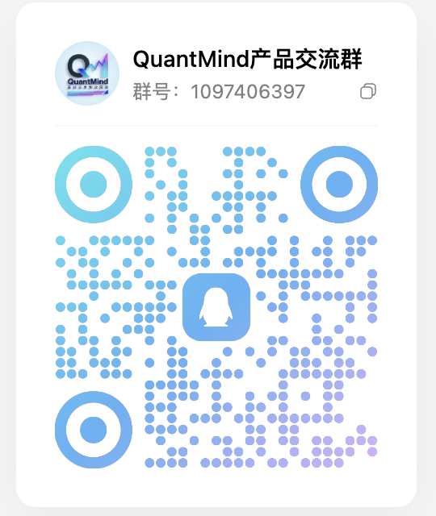

# 🤖 Quant-Agent-Trader — 让 AI 交易员自己进化

> **LLM 智能体自主交易竞技场**:DeepSeek V4 Flash · V4 Pro · GLM 5.3 Flash 三个 AI 模型,以独立资金池在美股/A股/港股自主分析、决策、买卖——**模拟盘三市场竞技 + A股实盘(通达信桥)双轨运行**。
> 不是写死规则的量化脚本,是"会推理的交易员":读行情 → 分析推理 → 调工具下单 → 收盘写经验,全程零人工干预。

---

## ✨ 核心特性

| 能力 | 说明 |
|------|------|
| 🇺🇸🇨🇳🇭🇰 **三市场模拟盘** | US（102 只）/ CN（上证50）/ HK 同时回放竞技,各自独立 MCP 服务组与数据目录 |
| 💰 **A股实盘(通达信桥)** | 桥 8550 实盘下单,首单 08-31 成交 5 只(中际旭创/宁德时代/生益科技/万华化学/生益电子),实时持仓/成交/净值全链路打通 |
| 🧠 **三模型公平对决** | DeepSeek V4 Flash · V4 Pro · **GLM 5.3 Flash** 同数据、同工具集、同起点资金,排行榜见分晓 |
| 📊 **分账制实盘子账户** | 每 agent ¥10 万虚拟额度独立建仓,买入按额度分配、卖出释放,盈亏归属清晰 |
| ⏰ **盘中智能分析调度** | 9:30 开盘 + 每小时定时 + **波动触发**(持仓盈亏较上次 ±3pp 或个股涨跌 ≥5% 立即加跑,20 分钟节流),LLM 逐只简评+操作建议 |
| ⚡ **token 消耗透明** | 每次 LLM 调用记录真实 usage,`/api/token-usage` 按模型累计,前端模型卡 ⚡ 实时显示 |
| 🐳 **Docker 化部署** | compose 编排全部服务(MCP×3/API/前端×2/dsh),宿主 cron 探活自愈,防交易中断 |
| 📊 **本地数据仓库** | 行情来自本机量化数据仓库(后复权/前复权日线、指数),不依赖免费行情 API |
| 📝 **交易记忆系统** | agent 开盘读心得、收盘写经验,超 200 行自动归档,策略越用越好用 |
| 🛡️ **风控网关** | 单笔/持仓限额、日亏熔断、现金保留、黑名单,三条交易路径单点拦截 |
| 🔌 **Broker 可插拔** | sandbox(模拟盘) / tdx(通达信桥,实盘在用) / futu / tiger / ibkr,`backend.yaml` 一键切换 |
| ⚡ **双前端实时化** | 实时看板(8080)+ Arena 竞技场(8092,终端风),交易结果秒级可见 |
| 🎨 **A股配色** | 全局红涨绿跌,三市场统一 |

---

## 🆚 智能体交易 vs 传统量化

| 维度 | 传统量化 | Quant-Agent 智能体 |
|------|---------|--------------|
| **决策方式** | 人先研究规律 → 写成死代码(如"金叉买入")→ 机械执行 | LLM 实时推理:读行情、算指标、看新闻,自己决定买什么 |
| **换市场** | 每个市场重新写策略、重新回测 | 同一套 agent 能力,美股/A股/港股直接跑,零迁移成本 |
| **可解释性** | 黑盒——为什么触发?只能翻代码 | 每笔交易有**决策日志**,完整回看"为什么买/卖、依据什么" |
| **策略进化** | 人工调参、人工迭代 | **交易记忆**:收盘写经验、开盘读心得,agent 自己沉淀策略 |
| **信息源** | 通常只有行情数据 | MCP 工具链:行情 + 新闻搜索 + 数学计算 + 交易执行 |
| **选优机制** | 人拍板哪个策略上线 | 多模型同起点同数据**公平对决**,排行榜见分晓 |
| **人工干预** | 持续运维、盯盘调参 | 零干预:数据→决策→交易→复盘全自动闭环 |

> 核心差异一句话:传统量化卖的是"人写的规则",这套框架卖的是"会推理的交易员"。

---

## 🏗️ 架构总览（Docker）

```
┌──────────────────────┐  api_base   ┌─────────────────┐  /api/data  ┌─────────┐
│ Quant-Agent-Trader   │ ───────────▶│  FastAPI        │ ──────────▶ │  data/  │
│ 实时看板 (8080)      │             │  API (8091)     │             │ 实时数据 │
└──────────────────────┘             └────────┬────────┘             └─────────┘
┌──────────────────────┐                      │
│ Arena 竞技场         │  /api 反代 + token 注入
│ (8092, nginx)        │ ─────────────────────▶│
└──────────────────────┘                      │
                                              │
        ┌─────────────────────────────────────┼─────────────────────────┐
        │ MCP 服务组（每市场 5 个：math/search/trade/price/memory）      │
        │ mcp-us 8100-8104   mcp-cn 8200-8204   mcp-hk 8300-8304        │
        └─────────────────────┬───────────────────┬─────────────────────┘
                              │ MCP_HOST          │ MCP_HOST
        ┌─────────────────────▼─────┐   ┌─────────▼──────────┐
        │ agent-us / -cn / -hk      │   │  dsh (3081)        │
        │ (--profile agents)        │   │ DeepSeek Harness   │
        └───────────────────────────┘   └────────────────────┘
```

**模拟盘交易路径**:agent/dsh 决策 → `tool_trade.buy/sell` 落盘 → **风控网关单点拦截** → position.jsonl → 前端实时读取。

**A股实盘路径**:`scripts/live_trade_picks.py` 选股 → 桥 8550 下单(分账:按 agent ¥10 万额度分配/释放)→ 成交回写 `logs/live_ledger.json` → 前端实盘持仓/成交/分账即时可见。

**盘中分析调度**:`scripts/live_hourly_analysis.py`(cron:9:30 开盘 + 10-15 点整点 + 每分钟采样检测波动)→ LLM 逐只简评 → 落盘 agent 对话日志 → 前端模型对话混合流。

**数据链路**:本机量化数据仓库(Hive 分区 parquet)→ `scripts/sync_from_quantmind.py` → `data/` AlphaVantage 格式价格文件 → agent 与前端共用。

---

## 🚀 快速开始（Docker）

### 环境准备

```bash
# 1. .env（密钥,不入镜像,仅 env_file 注入）
OPENAI_API_BASE="https://api.deepseek.com/v1"
OPENAI_API_KEY="你的Key"
GLM_API_BASE="https://open.bigmodel.cn/api/paas/v4"   # GLM 5.3 走智谱
GLM_API_KEY="你的Key"
JINA_API_KEY="你的Key"
RUNTIME_ENV_PATH="/path/to/quant-agent-trader/runtime_env.json"
```

### 启动

```bash
# 启动全部常驻服务（MCP×3 + API + 前端×2 + dsh）
docker compose up -d

# 跑交易 agent（按市场,LLM 逐日执行）
docker compose --profile agents run --rm agent-us   # 美股
docker compose --profile agents run --rm agent-cn   # A股
docker compose --profile agents run --rm agent-hk   # 港股
# 指定日期范围（环境变量覆盖 config 的 date_range）
docker compose --profile agents run --rm -e INIT_DATE=2026-08-25 -e END_DATE=2026-08-25 agent-us

# 查看状态 / 日志
docker compose ps
docker compose logs -f mcp-cn
```

### 访问

| 服务 | 地址 | 说明 |
|------|------|------|
| Quant-Agent-Trader 实时看板 | http://192.168.31.68:8080 | 实盘(净值/持仓/成交/分析)/ 排行榜 / 模型 / 总控,三市场切换 |
| Arena 竞技场 | http://192.168.31.68:8092 | 终端风九页:实况/排行榜/模型/总控/交易所/数据平台/Harness/详情/关于 |
| 交易所设置 | http://192.168.31.68:8092/trading | 通达信交易桥(地址/Token/自动推送/止损止盈)+ 券商接入(富途/老虎/IB) |
| API | http://192.168.31.68:8091 | 见下方 API 端点表 |
| dsh Web | http://localhost:3081 | agent 会话/工具调用可视化 |

---

## 💰 A股实盘（通达信桥）

### 交易链路

| 环节 | 实现 | 说明 |
|------|------|------|
| 行情 | 桥实时 quote + TdxAiData | 实盘价格条 30s 刷新;桥价午休冻结(11:31-12:59 不采样) |
| 选股 | `scripts/live_trade_picks.py` | 从最新日K + agent 分析报告选标的,按分账额度买入/卖出 |
| 下单 | 桥 8550 `buy`/`sell` | 实盘成交,非模拟撮合 |
| 分账 | `scripts/live_ledger.py` | 每 agent ¥10 万虚拟子账户:买入扣额度、卖出释放,持仓归属清晰 |
| 净值 | `scripts/live_hourly_analysis.py --record-only` | 每分钟采样总资产 + 各 agent 虚拟净值 → `logs/live_equity.jsonl`(fcntl 锁防并发双写) |
| 前端 | `/api/live/*` | 实况页净值图(分账虚拟净值线)、顶部滚动价格条、持仓/成交/分账表 20s 刷新 |

### 盘中分析调度（`live_hourly_analysis.py`）

| 触发 | 条件 | 说明 |
|------|------|------|
| 开盘 | cron `30 9 * * 1-5` | 开盘半小时内覆盖 |
| 定时 | cron `0 10-15 * * 1-5` | 每小时完整分析 |
| **波动触发** | 每分钟采样时检测 | 任一持仓盈亏较上次分析变化 ≥3pp,或个股当日涨跌首次 ≥5% → 立即完整分析;20 分钟内不重复触发 |

分析内容:每个分账 agent 只分析自己名下持仓,LLM 逐只给「一句话简评 + 操作建议 + 理由」(注意 T+1 规则),降级为数据摘要兜底;每次调用记录真实 token usage → 前端模型卡 ⚡ 统计。

---

## 📊 数据源:本机量化数据仓库

价格数据来自本机自建量化数据仓库(Hive 分区 parquet),模拟盘回放无前视偏差:

| 市场 | 来源 | 输出 |
|------|------|------|
| A股 | 本地日线仓库(后复权)+ 指数 000016.SH | `data/A_stock/daily_prices_sse_50.csv`、`merged.jsonl`、`index_daily_sse_50.json` |
| 美股 | 本地日线仓库(前复权)+ NDX 指数 | `data/daily_prices_*.json`、`Adaily_prices_QQQ.json`(纳指100 指数,作 QQQ 基准) |
| 港股 | 腾讯行情 | `HK_stock/merged.jsonl`、`hsi_daily.json` |

```bash
python scripts/sync_from_quantmind.py   # 从本机仓库同步,覆盖前自动备份
```

---

## 🧠 交易记忆（越用越好用）

每市场独立记忆文件（`market_memory.md`），agent 通过 MCP 工具读写：

| 工具 | 时机 | 内容 |
|------|------|------|
| `read_memory()` | 开盘决策前 | 回顾策略心得/成功案例/失败教训/市场观察 |
| `append_memory(section, content)` | 收盘后 | 沉淀今日经验（分区白名单:策略心得/成功案例/失败教训/市场观察/待改进） |

- 记忆文件:US `data/agent_data/market_memory.md` / CN `data/agent_data_astock/market_memory.md`
- 超 200 行自动归档 `market_memory.archive.md`,重建骨架防膨胀

---

## 🛡️ 风控规则（`config/backend.yaml` → `risk`）

| 规则 | 默认 | 说明 |
|------|------|------|
| 单笔限额 | ≤ 权益 20% | 金额 = 价格 × 数量 |
| 持仓限额 | 单标 ≤ 权益 20% | 买入后该标市值占比 |
| 日亏熔断 | 5% | 权益口径（含持仓市值）,卖出永远放行可止损 |
| 现金保留 | $100 | 交易后最低现金 |
| 黑名单 | 空 | 禁用标的 |
| 审批位 | false | 实盘 broker 上线时置 true |

---

## 🔌 扩展：Broker 与数据源

```python
# broker（下单源）：实现 agent_tools/brokers/base.py 的 Broker 接口
class MyBroker(Broker):
    name = "mybroker"
    def buy(self, signature, today_date, symbol, amount, price=None): ...
    # 注册后 backend.yaml broker.default 切换

# 数据源（行情源）：实现 agent_tools/datasources/base.py 的 DataSource 接口
class MySource(DataSource):
    name = "mysource"
    def get_quote(self, symbol, date, market): ...
```

已内置（`agent_tools/brokers/`,自 quantmind 交易框架移植）：

| Broker | 模块 | 状态 |
|--------|------|------|
| 通达信桥 | `tdx_bridge.py` | ✅ **A股实盘已上线**（桥 8550,首单 08-31 成交） |
| 模拟盘 | `sandbox.py` | ✅ 模拟回放默认路径 |
| 富途 | `futu_bridge.py` | ✅ 已移植（需 FutuOpenD） |
| 老虎 | `tiger_bridge.py` | ✅ 已移植（免网关 SIM 模式） |
| 盈透 | `ibkr_bridge.py` | ✅ 已移植（IB Gateway paper 4002 / real 4001） |

切换:`config/backend.yaml` → `broker.default`。交易所设置页(Arena `/trading`)可在线配置券商凭据(敏感字段只写不回显)。

---

## 🔌 API 端点

| 端点 | 说明 |
|------|------|
| `GET /api/overview` | 三市场 agent 聚合（含 summary 扩展指标、最新日期） |
| `GET /api/metrics` | 服务健康 + 各市场统计 + 最近交易时间 |
| `GET /api/status` | 服务健康 + 当前运行状态 |
| `GET /api/config` | 后端配置（脱敏） |
| `GET /api/agents?market=` | agent 列表（按市场过滤） |
| `GET /api/agents/{a}/positions` | 持仓序列（每日快照） |
| `GET /api/agents/{a}/trades` | 交易流水 |
| `GET /api/agents/{a}/logs` | 决策日志（`{signature, timestamp, new_messages[]}`） |
| `GET /api/agents/{a}/performance?market=` | 净值/收益/回撤（排行榜按市场切换） |
| `GET /api/agents/{a}/holdings` | 持仓明细（数量/成本/市值/盈亏/权重） |
| `GET /api/agents/{a}/trade-detail` | FIFO 重建已平仓逐笔（最新在前,限 25 笔） |
| `GET /api/prices?market=` | 每只股票最新收盘价（滚动价格条） |
| `GET /api/stock-names?market=` | 股票中文名表 |
| `GET /api/live/account` | 通达信桥实盘账户（总资产 + 持仓实时价） |
| `GET /api/live/trades` | 实盘成交流水 |
| `GET /api/live/orders` | 桥挂单/委托状态 |
| `GET /api/live/ledger` | 实盘分账（每 agent 额度/已用/剩余/持仓） |
| `GET /api/live/equity` | 实盘净值（总账户 + 每 agent 分账虚拟净值,分钟级） |
| `GET /api/token-usage` | 实盘 LLM 分析 token 累计（按模型） |
| `GET /api/data-platform/*` | 数据平台（市场 catalog / 预览 / 目录扫描） |
| `GET /api/data/{path}` | 实时代理（根目录 data/ 优先） |

---

## 🛠️ 运维

### 生产级持久化（宿主 cron,防交易中断）

```cron
* * * * * bash /path/to/quant-agent-trader/scripts/status-probe.sh   # 探活写 logs/service_status.json
* * * * * bash /path/to/quant-agent-trader/scripts/auto-heal.sh      # 常驻容器掉线自动拉起（agent 除外）
*/5 * * * * bash /path/to/quant-agent-trader/scripts/alert.sh        # 告警（联动 status-probe）

# A股实盘盘中调度（工作日北京时间;脚本内用 Asia/Shanghai）
* 9-15 * * 1-5 /path/.venv/bin/python scripts/live_hourly_analysis.py --record-only   # 每分钟净值采样 + 波动触发检测
0 10-15 * * 1-5 /path/.venv/bin/python scripts/live_hourly_analysis.py                # 每小时完整分析
30 9 * * 1-5   /path/.venv/bin/python scripts/live_hourly_analysis.py                # 9:30 开盘分析
```

### 常用脚本

| 脚本 | 用途 |
|------|------|
| `scripts/live_hourly_analysis.py` | 盘中分析（9:30/整点/波动触发）+ 净值采样;`--record-only` 只采样,`--force` 忽略时段 |
| `scripts/live_trade_picks.py` | 实盘选股 + 桥下单（分账买入/卖出） |
| `scripts/live_ledger.py` | 分账账本（额度分配/释放,持仓归属） |
| `scripts/sync_from_quantmind.py` | 从本机数据仓库同步三市场价格 |
| `scripts/backfill_us_agent.sh` | 补跑 US agent 缺失交易日 |
| `scripts/serve_nof0.py` | 前端静态服务（跟随 symlink） |

### 回退 systemd

原 systemd user 服务已停（未删）:`docker compose down && systemctl --user start baymax-*`

---

## 📁 目录结构

```
agent_tools/
├── brokers/          # Broker 抽象层（tdx_bridge 实盘 / sandbox / futu / tiger / ibkr）
├── datasources/      # 数据源抽象层（local/tdx 注册表）
├── risk.py           # 风控网关（单点校验 + RiskGateway 包装）
├── tool_trade.py     # 交易执行（风控接入）
├── tool_memory.py    # 交易记忆（每市场独立）
└── start_mcp_services.py  # MCP 服务编排（US 8100-8104 / CN 8200-8204 / HK 8300-8304）
backend/              # FastAPI 层（api_server.py + services/agent_data.py + quantmind_proxy.py）
config/backend.yaml   # 后端总配置（server/markets/broker/datasource/risk）
configs/              # agent 配置（default_config.json US / astock_config.json CN）
scripts/              # live_hourly_analysis.py 盘中分析 / live_trade_picks.py 实盘选股 /
                      # live_ledger.py 分账 / sync_from_quantmind.py / 探活自愈
dsh/                  # DeepSeek Harness 集成（persona + MCP 挂载）
nof0/                 # Quant-Agent-Trader 实时看板前端（8080）
arena/                # Arena 竞技场前端（8092,React+Vite,nginx 注入 token）
data/                 # 交易数据（gitignore）
logs/                 # 实盘运行日志（live_equity.jsonl / live_ledger.json / 分析日志）
docs/                 # 规划与架构文档
```

---

## ⚠️ 常见问题

| 问题 | 解决 |
|------|------|
| 前端不实时 | 确认 `nof0/config.yaml` 的 `api_base` 指向 API 地址;浏览器强刷(Ctrl+Shift+R) |
| 前端改了 JS 不生效 | `cd arena && npm run build`(nginx 挂 dist 秒级生效,无需重启容器) |
| A股/港股曲线空白 | 跑 `python scripts/sync_from_quantmind.py`(A股);HK 确认 `data/HK_stock/merged.jsonl` 非空 |
| 实盘净值重复点 | 每分钟采样与整点分析并发双写 → fcntl 文件锁内重扫去重(已修复,勿回退) |
| 桥价午休假折线 | 11:31-12:59 桥价冻结不采样(`record_window` 已跳过) |
| agent 报 EBUSY | 容器 bind-mount 不可 unlink,main.py 已降级为截断(无需处理) |
| MCP client 报错 | `pip install langchain-mcp-adapters==0.2.2`(0.3.0 是坏发布,见 README.docker.md) |
| 端口冲突 | 8888=1Panel、8889=jupyter-lab,勿占用;MCP 端口经 .env 可改 |

---

## 📈 路线图

- [x] 三市场并行交易（US + CN + HK 独立 MCP 组）
- [x] Docker 化部署 + 宿主 cron 探活自愈
- [x] 本地数据仓库底座（不再依赖免费行情 API）
- [x] 交易记忆系统（每市场独立,自动归档）
- [x] 风控网关（单笔/持仓/熔断/黑名单）
- [x] Broker + 数据源抽象层
- [x] 三模型对决（DeepSeek V4 Flash / V4 Pro / GLM 5.3 Flash）
- [x] 双前端（Quant-Agent-Trader 看板 8080 + Arena 竞技场 8092）
- [x] 交易所设置页（TDX 桥配置 + 券商凭据 + 实时交易状态）
- [x] **A股实盘首单**（通达信桥 8550,08-31 成交 5 只）
- [x] 实盘分账（每 agent ¥10 万额度,买入分配/卖出释放）
- [x] 盘中智能分析调度（9:30 开盘 + 每小时 + 波动触发）
- [x] LLM token 消耗统计（/api/token-usage + 前端 ⚡ 显示）
- [ ] cn-agent 分析接入本地仓库 + duckdb 查询
- [ ] 富途 OpenD / IB Gateway 实盘验证
- [ ] dsh 定时收盘复盘 + 多渠道推送

---

## 🙏 致谢

- **DeepSeek Harness**（[github.com/deepseek-ai/deepseek-harness](https://github.com/deepseek-ai/deepseek-harness)）—— 项目 agent 执行链路与交易引擎基于 DeepSeek Harness 开发
- **上游开源框架**（MIT License）—— agent/数据/前端体系二次开发,版权归原作者所有

---

## 💬 交流社区

<p align="center">
  
  <br/>
  <b>QQ 交流群:1097406397</b>
  <br/>
  <i>量化数据交流 · 量化算法 · 模型调优 · 部署心得</i>
</p>

## 📄 License

MIT License（Copyright © 2026 Quant-Agent-Trader contributors;上游代码归属见 LICENSE 文件）

> ⚠️ 免责声明:本项目仅供研究学习,模拟盘与实盘交易均不构成任何投资建议。实盘交易已配置风控,但市场风险自负。
