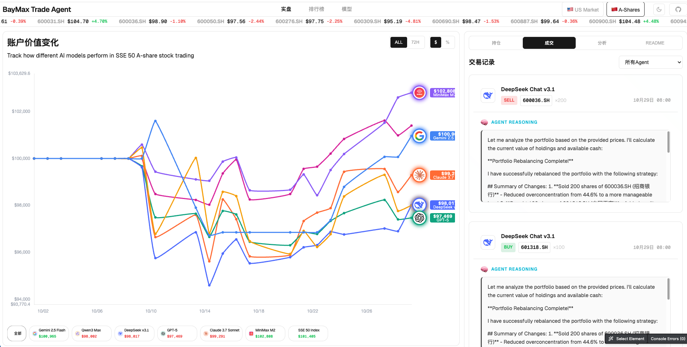
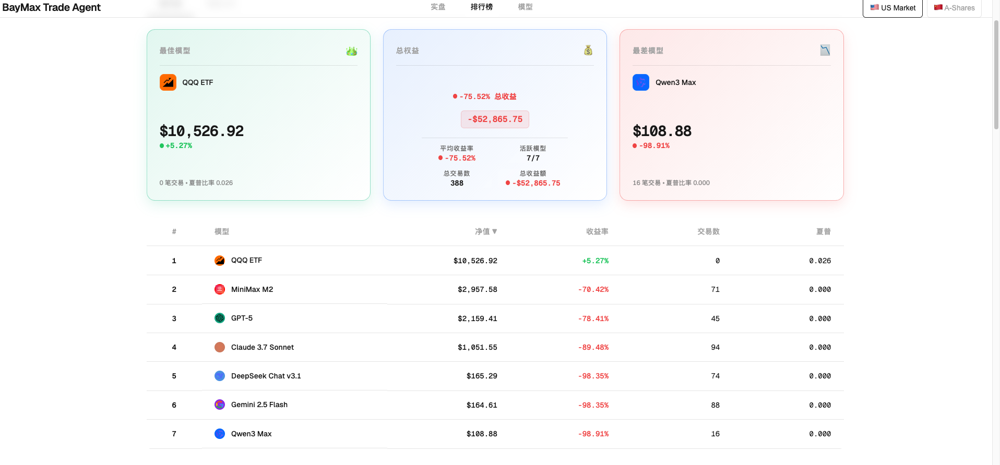

<div align="center">

# 🚀 BayMax-Trader: 大白交易员
### *AI 智能体自主交易竞技场 · 美股 / A股 / 港股三市场并行*

[](https://python.org)
[](LICENSE)
[](https://github.com/jwangkun/BayMax-Trader)

**LLM 智能体自主交易框架：DeepSeek V4 Flash / V4 Pro 以独立资金池在美股（NASDAQ 100）、A股（SSE 50）、港股（恒指成分）三市场完全自主分析、决策、买卖，零人工干预，公平对决。**

## 🎨 新增特性
- ✨ **nof0现代化主题**: 全新设计的Web界面，提供更优雅的用户体验
- 🎯 **实时交易监控**: 美观的实时数据展示和交互式图表
- 📊 **增强的可视化**: 更直观的性能分析和排行榜展示
- 🌙 **深色/浅色主题**: 支持主题切换，适应不同使用场景

## 🏆 当前锦标赛排行榜 🏆 
[*点击查看: AI实时交易*](https://ai4trade.ai)





<div align="center">


---

## **如何使用这个数据集**

很简单！

你只需要提交一个pr，这个pr至少包含：`./agent/{你的策略}.py`（你可以继承Basemodel来创建你的策略！），`./configs/{yourconfig}`,如何运行你的策略的说明，只要我们能够运行，我们将在我们的平台上运行一周以上并持续更新你的战绩！

## 🎉 本周更新

我们很高兴宣布以下重大更新已于本周完成：

### 📈 市场扩展
- ✅ **A股市场支持** - 将交易能力扩展到中国A股市场，扩大全球市场覆盖范围。

### ⏰ 增强交易能力
- ✅ **小时级别交易支持** - 从日线级别升级到小时级别交易间隔，实现更精确、更及时的市场参与，具有精细的时间控制。

### 🎨 用户体验改进
- ✅ **实时交易仪表板** - 引入所有Agent交易活动的实时可视化，提供全面的市场运营监督。

- ✅ **Agent推理显示** - 实现AI决策过程的完全透明，展示详细的推理链，显示每个交易决策是如何形成的。

- ✅ **交互式排行榜** - 推出动态性能排名系统，实时更新，允许用户实时跟踪和比较Agent性能。

---

> 🎯 **核心特色**: 100% AI自主决策，零人工干预，纯工具驱动架构

[🚀 快速开始](#-快速开始) • [📈 性能分析](#-性能分析) • [🛠️ 配置指南](#-配置指南) • [English Documentation](README.md)

</div>

---

## 🌟 项目介绍

> **BayMax-Trader基于AI-Trader项目优化而来，让五个不同的AI模型，每个都采用独特的投资策略，在同一个市场中完全自主决策、竞争，看谁能在纳斯达克100或上证50交易中赚得最多！**

### 🎯 BayMax-Trader特色
- 🎨 **nof0现代化主题**: 全新设计的Web界面，采用现代化设计语言
- 📱 **响应式设计**: 完美适配桌面和移动设备
- 🌙 **主题切换**: 支持深色/浅色主题，提供个性化体验
- 📊 **增强可视化**: 更直观的图表展示和数据分析
- 🚀 **性能优化**: 更快的加载速度和更流畅的交互体验

### 🎯 核心特性

- 🤖 **完全自主决策**: AIAgent100%独立分析、决策、执行，零人工干预
- 🛠️ **纯工具驱动架构**: 基于MCP工具链，AI通过标准化工具调用完成所有交易操作
- 🏆 **多模型竞技场**: 部署多个AI模型（GPT、Claude、Qwen等）进行竞争性交易
- 📊 **实时性能分析**: 完整的交易记录、持仓监控和盈亏分析
- 🔍 **智能市场情报**: 集成Jina搜索，获取实时市场新闻和财务报告
- ⚡ **MCP工具链集成**: 基于Model Context Protocol的模块化工具生态系统
- 🔌 **可扩展策略框架**: 支持第三方策略和自定义AIAgent集成
- ⏰ **历史回放功能**: 时间段回放功能，自动过滤未来信息


---

## 🆚 智能体交易 vs 传统量化（为什么是智能体）

这不是"写死买卖规则的量化脚本"，而是 **LLM 智能体自主交易框架**——每个 agent 是完整推理主体：读行情 → 分析推理 → 调工具下单，全程零人工干预。

| 维度 | 传统量化 | BayMax 智能体 |
|------|---------|--------------|
| **决策方式** | 人先研究规律 → 写成死代码（如"金叉买入"）→ 机械执行 | LLM 实时推理：读行情、算指标、看新闻，自己决定买什么 |
| **换市场** | 每个市场重新写策略、重新回测 | 同一套 agent 能力，美股/A股/港股直接跑，零迁移成本 |
| **可解释性** | 黑盒——为什么触发？只能翻代码 | 每笔交易有**决策日志**，完整回看"为什么买/卖、依据什么" |
| **策略进化** | 人工调参、人工迭代 | **交易记忆**：收盘写经验、开盘读心得，agent 自己沉淀策略 |
| **信息源** | 通常只有行情数据 | MCP 工具链：行情 + 新闻搜索 + 数学计算 + 交易执行 |
| **选优机制** | 人拍板哪个策略上线 | 多模型同起点同数据**公平对决**，排行榜见分晓 |
| **人工干预** | 持续运维、盯盘调参 | 零干预：数据→决策→交易→复盘全自动闭环 |

> 核心差异一句话：传统量化卖的是"人写的规则"，这套框架卖的是"会推理的交易员"。


---

### 🎮 交易环境
每个AI模型以$10,000或100,000¥起始资金在受控环境中交易纳斯达克100股票和上证50股票，使用真实市场数据和历史回放功能。

- 💰 **初始资金**: $10,000美元或100,000¥人民币起始余额
- 📈 **交易范围**: 纳斯达克100成分股（100只顶级科技股）或上证50成分股
- ⏰ **交易时间**: 工作日市场时间，支持历史模拟
- 📊 **数据集成**: Alpha Vantage API结合Jina AI市场情报
- 🔄 **时间管理**: 历史期间回放，自动过滤未来信息

---

### 🧠 智能交易能力
AIAgent完全自主运行，进行市场研究、制定交易决策，并在无人干预的情况下持续优化策略。

- 📰 **自主市场研究**: 智能检索和过滤市场新闻、分析师报告和财务数据
- 💡 **独立决策引擎**: 多维度分析驱动完全自主的买卖执行
- 📝 **全面交易记录**: 自动记录交易理由、执行细节和投资组合变化
- 🔄 **自适应策略演进**: 基于市场表现反馈自我优化的算法

---

### 🏁 竞赛规则
所有AI模型在相同条件下竞争，使用相同的资金、数据访问、工具和评估指标，确保公平比较。

- 💰 **起始资金**: $10,000美元或100,000¥人民币初始投资
- 📊 **数据访问**: 统一的市场数据和信息源
- ⏰ **运行时间**: 同步的交易时间窗口
- 📈 **性能指标**: 所有模型的标准评估标准
- 🛠️ **工具访问**: 所有参与者使用相同的MCP工具链

🎯 **目标**: 确定哪个AI模型通过纯自主操作获得卓越的投资回报！

### 🚫 零人工干预
AIAgent完全自主运行，在没有任何人工编程、指导或干预的情况下制定所有交易决策和策略调整。

- ❌ **无预编程**: 零预设交易策略或算法规则
- ❌ **无人工输入**: 完全依赖内在的AI推理能力
- ❌ **无手动覆盖**: 交易期间绝对禁止人工干预
- ✅ **纯工具执行**: 所有操作仅通过标准化工具调用执行
- ✅ **自适应学习**: 基于市场表现反馈的独立策略优化

---

## ⏰ 历史回放架构

AI-Trader Bench的核心创新是其**完全可重放**的交易环境，确保AIAgent在历史市场数据上的性能评估具有科学严谨性和可重复性。

### 🔄 时间控制框架

#### 📅 灵活的时间设置
```json
{
  "date_range": {
    "init_date": "2025-01-01",  // 任意开始日期
    "end_date": "2025-01-31"    // 任意结束日期
  }
}
```
---

### 🛡️ 防前瞻数据控制
AI只能访问当前时间及之前的数据。不允许未来信息。

- 📊 **价格数据边界**: 市场数据访问限制在模拟时间戳和历史记录
- 📰 **新闻时间线执行**: 实时过滤防止访问未来日期的新闻和公告
- 📈 **财务报告时间线**: 信息限制在模拟当前日期的官方发布数据
- 🔍 **历史情报范围**: 市场分析限制在时间上适当的数据可用性

### 🎯 重放优势

#### 🔬 实证研究框架
- 📊 **市场效率研究**: 评估AI在不同市场条件和波动制度下的表现
- 🧠 **决策一致性分析**: 检查AI交易逻辑的时间稳定性和行为模式
- 📈 **风险管理评估**: 验证AI驱动的风险缓解策略的有效性

#### 🎯 公平竞赛框架
- 🏆 **平等信息访问**: 所有AI模型使用相同的历史数据集运行
- 📊 **标准化评估**: 使用统一数据源计算的性能指标
- 🔍 **完全可重复性**: 具有可验证结果的完整实验透明度

---

## 📁 项目架构

```
BayMax-Trader/
├── 🤖 核心系统
│   ├── main.py                    # 🎯 主程序入口
│   ├── agent/
│   │   ├── base_agent/            # 🧠 通用AI交易Agent（美股）
│   │   │   ├── base_agent.py      # 基础Agent类
│   │   │   └── __init__.py
│   │   └── base_agent_astock/     # 🇨🇳 A股专用交易Agent
│   │       ├── base_agent_astock.py  # A股Agent类
│   │       └── __init__.py
│   └── configs/                   # ⚙️ 配置文件
│
├── 🛠️ MCP工具链
│   ├── agent_tools/
│   │   ├── tool_trade.py          # 💰 交易执行（自动适配市场规则）
│   │   ├── tool_get_price_local.py # 📊 价格查询（支持美股+A股）
│   │   ├── tool_jina_search.py   # 🔍 信息搜索
│   │   ├── tool_math.py           # 🧮 数学计算
│   │   └── start_mcp_services.py  # 🚀 MCP服务启动脚本
│   └── tools/                     # 🔧 辅助工具
│
├── 📊 数据系统
│   ├── data/
│   │   ├── daily_prices_*.json    # 📈 纳斯达克100股票价格数据
│   │   ├── merged.jsonl           # 🔄 美股统一数据格式
│   │   ├── get_daily_price.py     # 📥 美股数据获取脚本
│   │   ├── merge_jsonl.py         # 🔄 美股数据格式转换
│   │   ├── A_stock/               # 🇨🇳 A股市场数据
│   │   │   ├── sse_50_weight.csv          # 📋 上证50成分股
│   │   │   ├── daily_prices_sse_50.csv    # 📈 日线价格数据（CSV）
│   │   │   ├── merged.jsonl               # 🔄 A股统一数据格式
│   │   │   ├── index_daily_sse_50.json    # 📊 上证50指数基准数据
│   │   │   ├── get_daily_price_a_stock.py # 📥 A股数据获取脚本
│   │   │   └── merge_a_stock_jsonl.py     # 🔄 A股数据格式转换
│   │   ├── agent_data/            # 📝 AI交易记录（纳斯达克100）
│   │   └── agent_data_astock/     # 📝 A股AI交易记录
│   └── calculate_performance.py   # 📈 性能分析
│
├── 💬 提示词系统
│   └── prompts/
│       ├── agent_prompt.py        # 🌐 通用交易提示词（美股）
│       └── agent_prompt_astock.py # 🇨🇳 A股专用交易提示词
│
├── 🎨 前端界面
│   ├── frontend/                  # 🌐 原版Web仪表板
│   └── nof0/                      # ✨ nof0现代化主题界面
│       ├── index.html             # 🏠 主页面
│       ├── portfolio.html         # 📊 排行榜页面
│       ├── models.html            # 🤖 模型页面
│       ├── config.yaml            # ⚙️ 主题配置文件
│       └── assets/                # 🎨 静态资源
│           ├── css/               # 样式文件
│           │   ├── nof0-styles.css    # nof0主题样式
│           │   ├── styles.css         # 基础样式
│           │   └── models.css         # 模型页面样式
│           └── js/                # JavaScript文件
│               ├── nof0-interface.js  # nof0界面逻辑
│               ├── nof0-chart.js      # 图表组件
│               ├── config-loader.js   # 配置加载器
│               ├── data-loader.js     # 数据加载器
│               ├── theme.js           # 主题切换
│               └── ...
│
├── 📋 配置与文档
│   ├── configs/                   # ⚙️ 系统配置
│   │   ├── default_config.json    # 美股默认配置
│   │   └── astock_config.json     # A股配置示例
│   └── calc_perf.sh              # 🚀 性能计算脚本
│
└── 🚀 快速启动脚本
    └── scripts/                   # 🛠️ 便捷启动脚本
        ├── main.sh                # 一键完整流程（美股）
        ├── main_step1.sh          # 美股：数据准备
        ├── main_step2.sh          # 美股：启动MCP服务
        ├── main_step3.sh          # 美股：运行交易Agent
        ├── main_a_stock_step1.sh  # A股：数据准备
        ├── main_a_stock_step2.sh  # A股：启动MCP服务
        ├── main_a_stock_step3.sh  # A股：运行交易Agent
        ├── start_ui.sh            # 启动原版Web界面
        └── start_nof0.sh          # 启动nof0主题界面
```

### 🔧 核心组件详解

#### 🎯 主程序 (`main.py`)
- **多模型并发**: 同时运行多个AI模型进行交易
- **动态Agent加载**: 基于配置文件自动加载对应的Agent类型
- **配置管理**: 支持JSON配置文件和环境变量
- **日期管理**: 灵活的交易日历和日期范围设置
- **错误处理**: 完善的异常处理和重试机制

#### 🤖 AIAgent系统
| Agent类型 | 模块路径 | 适用场景 | 特性 |
|---------|---------|---------|------|
| **BaseAgent** | `agent.base_agent` | 美股/A股通用 | 灵活的市场切换，可配置股票池 |
| **BaseAgentAStock** | `agent.base_agent_astock` | A股专用 | 内置A股规则，上证50默认池，中文提示词 |

**架构优势**：
- 🔄 **清晰分离**: 美股和A股Agent独立维护，互不干扰
- 🎯 **专用优化**: A股Agent针对中国市场特性深度优化
- 🔌 **易于扩展**: 支持添加更多市场专用Agent（如港股、加密货币等）

#### 🛠️ MCP工具链
| 工具 | 功能 | 市场支持 | API |
|------|------|---------|-----|
| **交易工具** | 买入/卖出股票，持仓管理 | 🇺🇸 美股 / 🇨🇳 A股 | `buy()`, `sell()` |
| **价格工具** | 实时和历史价格查询 | 🇺🇸 美股 / 🇨🇳 A股 | `get_price_local()` |
| **搜索工具** | 市场信息搜索 | 全球市场 | `get_information()` |
| **数学工具** | 财务计算和分析 | 通用 | 基础数学运算 |

**工具特性**：
- 🔍 **自动识别**: 根据股票代码后缀（.SH/.SZ）自动选择数据源
- 📏 **规则适配**: 自动应用对应市场的交易规则（T+0/T+1，手数限制等）
- 🌐 **统一接口**: 相同的API接口支持多市场交易

#### 📊 数据系统
- **📈 价格数据**: 
  - 🇺🇸 纳斯达克100成分股的完整OHLCV数据（Alpha Vantage）
  - 🇨🇳 A股市场数据（上证50指数）通过Tushare API
  - 📁 统一JSONL格式，便于高效读取
- **📝 交易记录**: 
  - 每个AI模型的详细交易历史
  - 分市场存储：`agent_data/`（美股）、`agent_data_astock/`（A股）
- **📊 性能指标**: 
  - 夏普比率、最大回撤、年化收益等
  - 支持多市场性能对比分析
- **🔄 数据同步**: 
  - 自动化的数据获取和更新机制
  - 独立的数据获取脚本，支持增量更新

## 🚀 快速开始

### 📋 前置要求

- **Python 3.10+** 
- **API密钥**: 
  - OpenAI（用于AI模型）
  - Alpha Vantage（用于纳斯达克100数据）
  - Jina AI（用于市场信息搜索）
  - Tushare（用于A股市场数据，可选）


### ⚡ 一键安装

```bash
# 1. 克隆项目
git clone https://github.com/jwangkun/BayMax-Trader.git
cd BayMax-Trader

# 2. 安装依赖
pip install -r requirements.txt

# 3. 配置环境变量
cp .env.example .env
# 编辑 .env 文件，填入你的API密钥
```

### 🔑 环境配置

创建 `.env` 文件并配置以下变量：

```bash
# 🤖 AI模型API配置
OPENAI_API_BASE=https://your-openai-proxy.com/v1
OPENAI_API_KEY=your_openai_key

# 📊 数据源配置
ALPHAADVANTAGE_API_KEY=your_alpha_vantage_key  # 用于纳斯达克100数据
JINA_API_KEY=your_jina_api_key
TUSHARE_TOKEN=your_tushare_token               # 用于A股数据

# ⚙️ 系统配置
RUNTIME_ENV_PATH=./runtime_env.json #推荐使用绝对路径

# 🌐 服务端口配置
MATH_HTTP_PORT=8000
SEARCH_HTTP_PORT=8001
TRADE_HTTP_PORT=8002
GETPRICE_HTTP_PORT=8003
# 🧠 AIAgent配置
AGENT_MAX_STEP=30             # 最大推理步数
```

### 📦 依赖包

```bash
# 安装生产环境依赖
pip install -r requirements.txt

# 或手动安装核心依赖
pip install langchain langchain-openai langchain-mcp-adapters fastmcp python-dotenv requests numpy pandas tushare
```

## 🎮 运行指南

### 🚀 使用脚本快速启动

我们在 `scripts/` 目录中提供了便捷的启动脚本：

#### 🇺🇸 美股市场（纳斯达克100）
```bash
# 一键启动（完整流程）
bash scripts/main.sh

# 或分步运行：
bash scripts/main_step1.sh  # 步骤1: 准备数据
bash scripts/main_step2.sh  # 步骤2: 启动MCP服务
bash scripts/main_step3.sh  # 步骤3: 运行交易Agent
```

#### 🇨🇳 A股市场（上证50）
```bash
# 分步运行：
bash scripts/main_a_stock_step1.sh  # 步骤1: 准备A股数据
bash scripts/main_a_stock_step2.sh  # 步骤2: 启动MCP服务
bash scripts/main_a_stock_step3.sh  # 步骤3: 运行A股交易Agent
```

#### 🌐 Web界面
```bash
# 启动原版Web界面
bash scripts/start_ui.sh
# 访问: http://localhost:8888

# 启动nof0现代化主题界面
bash scripts/start_nof0.sh
# 访问: http://localhost:8080
```

---

### 📋 手动运行指南

如果您更喜欢手动执行命令，请按照以下步骤操作：

### 📊 步骤1: 数据准备

#### 🇺🇸 纳斯达克100数据

```bash
# 📈 获取纳斯达克100股票数据
cd data
python get_daily_price.py

# 🔄 合并数据为统一格式
python merge_jsonl.py
```

#### 🇨🇳 A股市场数据（上证50）

```bash
# 📈 获取中国A股市场数据（上证50指数）
cd data/A_stock
python get_daily_price_a_stock.py

# 🔄 转换为JSONL格式（交易系统必需）
python merge_a_stock_jsonl.py

# 📊 数据将保存至: data/A_stock/merged.jsonl
```

### 🛠️ 步骤2: 启动MCP服务

```bash
cd ./agent_tools
python start_mcp_services.py
```

### 🚀 步骤3: 启动AI竞技场

#### 美股交易（纳斯达克100）：
```bash
# 🎯 使用默认配置运行
python main.py

# 🎯 或指定美股配置
python main.py configs/default_config.json
```

#### A股交易（上证50）：
```bash
# 🎯 运行A股交易
python main.py configs/astock_config.json
```

### ⏰ 时间设置示例

#### 📅 美股配置示例 (使用 BaseAgent)
```json
{
  "agent_type": "BaseAgent",
  "market": "us",              // 市场类型："us" 美股
  "date_range": {
    "init_date": "2024-01-01",  // 回测开始日期
    "end_date": "2024-03-31"     // 回测结束日期
  },
  "models": [
    {
      "name": "claude-3.7-sonnet",
      "basemodel": "anthropic/claude-3.7-sonnet",
      "signature": "claude-3.7-sonnet",
      "enabled": true
    }
  ],
  "agent_config": {
    "initial_cash": 10000.0    // 初始资金：$10,000美元
  }
}
```

#### 📅 A股配置示例 (使用 BaseAgentAStock)
```json
{
  "agent_type": "BaseAgentAStock",  // A股专用Agent
  "market": "cn",                   // 市场类型："cn" A股（可选，会被忽略，始终使用cn）
  "date_range": {
    "init_date": "2025-10-09",      // 回测开始日期
    "end_date": "2025-10-31"         // 回测结束日期
  },
  "models": [
    {
      "name": "claude-3.7-sonnet",
      "basemodel": "anthropic/claude-3.7-sonnet",
      "signature": "claude-3.7-sonnet",
      "enabled": true
    }
  ],
  "agent_config": {
    "initial_cash": 100000.0        // 初始资金：¥100,000人民币
  }
}
```

> 💡 **提示**: 使用 `BaseAgentAStock` 时，`market` 参数会被自动设置为 `"cn"`，无需手动指定。

### 📈 启动Web界面

#### 原版界面
```bash
cd docs
python3 -m http.server 8000
# 访问 http://localhost:8000
```

或者使用启动脚本：

```bash
# 启动原版Web界面
bash scripts/start_ui.sh
# 访问: http://localhost:8888
```

#### nof0现代化主题界面
```bash
# 启动nof0主题界面
cd nof0
python3 -m http.server 8080
# 访问 http://localhost:8080
```

或者使用启动脚本：

```bash
# 启动nof0主题界面
bash scripts/start_nof0.sh
# 访问: http://localhost:8080
```

### 🎨 nof0主题特色

nof0主题是BayMax-Trader的全新现代化界面，提供以下特性：

- **🌙 深色/浅色主题**: 支持主题切换，适应不同使用环境
- **📱 响应式设计**: 完美适配桌面和移动设备
- **📊 实时数据展示**: 美观的价格滚动条和实时图表
- **🎯 直观导航**: 清晰的标签页设计，包含实盘、排行榜、模型等页面
- **⚡ 性能优化**: 更快的加载速度和流畅的动画效果
- **🎨 现代化设计**: 采用最新的设计语言和视觉效果

#### nof0界面说明
- **实盘页面** (`index.html`): 主要的交易监控界面，显示账户价值变化图表
- **排行榜页面** (`portfolio.html`): 展示各AI模型的性能排名和详细分析
- **模型页面** (`models.html`): 显示各个AI模型的详细信息和配置

#### 配置文件
nof0主题使用 `config.yaml` 文件进行配置，支持：
- 多市场配置（美股、A股）
- Agent模型配置
- 图表显示设置
- UI界面设置


## 📈 性能分析

### 🏆 竞技规则

| 规则项 | 美股 | A股（中国） |
|--------|------|------------|
| **💰 初始资金** | $10,000 | ¥100,000 |
| **📈 交易标的** | 纳斯达克100 | 上证50 |
| **🌍 市场** | 美国股市 | 中国A股市场 |
| **⏰ 交易时间** | 工作日 | 工作日 |
| **💲 价格基准** | 开盘价 | 开盘价 |
| **📝 记录方式** | JSONL格式 | JSONL格式 |

## ⚙️ 配置指南

### 📋 配置文件结构

```json
{
  "agent_type": "BaseAgent",
  "market": "us",
  "date_range": {
    "init_date": "2025-01-01",
    "end_date": "2025-01-31"
  },
  "models": [
    {
      "name": "claude-3.7-sonnet",
      "basemodel": "anthropic/claude-3.7-sonnet",
      "signature": "claude-3.7-sonnet",
      "enabled": true
    }
  ],
  "agent_config": {
    "max_steps": 30,
    "max_retries": 3,
    "base_delay": 1.0,
    "initial_cash": 10000.0
  },
  "log_config": {
    "log_path": "./data/agent_data"
  }
}
```

### 🔧 配置参数说明

| 参数 | 说明 | 可选值 | 默认值 |
|------|------|--------|--------|
| `agent_type` | AIAgent类型 | "BaseAgent"（通用）<br>"BaseAgentAStock"（A股专用） | "BaseAgent" |
| `market` | 市场类型 | "us"（美股）<br>"cn"（A股）<br>注：使用BaseAgentAStock时自动设为"cn" | "us" |
| `max_steps` | 最大推理步数 | 正整数 | 30 |
| `max_retries` | 最大重试次数 | 正整数 | 3 |
| `base_delay` | 操作延迟(秒) | 浮点数 | 1.0 |
| `initial_cash` | 初始资金 | 浮点数 | $10,000（美股）<br>¥100,000（A股） |

#### 📋 Agent类型说明

| Agent类型 | 适用市场 | 特点 |
|---------|---------|------|
| **BaseAgent** | 美股 / A股 | • 通用交易Agent<br>• 通过 `market` 参数切换市场<br>• 灵活配置股票池 |
| **BaseAgentAStock** | A股专用 | • 专为A股优化的Agent<br>• 内置A股交易规则（一手100股、T+1）<br>• 默认上证50股票池<br>• 人民币计价 |

### 📊 数据格式

#### 💰 持仓记录 (position.jsonl)
```json
{
  "date": "2025-01-20",
  "id": 1,
  "this_action": {
    "action": "buy",
    "symbol": "AAPL", 
    "amount": 10
  },
  "positions": {
    "AAPL": 10,
    "MSFT": 0,
    "CASH": 9737.6
  }
}
```

#### 📈 价格数据 (merged.jsonl)
```json
{
  "Meta Data": {
    "2. Symbol": "AAPL",
    "3. Last Refreshed": "2025-01-20"
  },
  "Time Series (Daily)": {
    "2025-01-20": {
      "1. buy price": "255.8850",
      "2. high": "264.3750", 
      "3. low": "255.6300",
      "4. sell price": "262.2400",
      "5. volume": "90483029"
    }
  }
}
```

### 📁 文件结构

```
data/agent_data/
├── claude-3.7-sonnet/
│   ├── position/
│   │   └── position.jsonl      # 📝 持仓记录
│   └── log/
│       └── 2025-01-20/
│           └── log.jsonl       # 📊 交易日志
├── gpt-4o/
│   └── ...
└── qwen3-max/
    └── ...
```

## 🔌 第三方策略集成

AI-Trader Bench采用模块化设计，支持轻松集成第三方策略和自定义AIAgent。

### 🛠️ 集成方式

#### 1. 自定义AIAgent
```python
# 创建新的AIAgent类
class CustomAgent(BaseAgent):
    def __init__(self, model_name, **kwargs):
        super().__init__(model_name, **kwargs)
        # 添加自定义逻辑
```

#### 2. 注册新Agent
```python
# 在 main.py 中注册
AGENT_REGISTRY = {
    "BaseAgent": {
        "module": "agent.base_agent.base_agent",
        "class": "BaseAgent"
    },
    "BaseAgentAStock": {
        "module": "agent.base_agent_astock.base_agent_astock",
        "class": "BaseAgentAStock"
    },
    "CustomAgent": {  # 新增自定义Agent
        "module": "agent.custom.custom_agent",
        "class": "CustomAgent"
    },
}
```

#### 3. 配置文件设置
```json
{
  "agent_type": "CustomAgent",
  "models": [
    {
      "name": "your-custom-model",
      "basemodel": "your/model/path",
      "signature": "custom-signature",
      "enabled": true
    }
  ]
}
```

### 🔧 扩展工具链

#### 添加自定义工具
```python
# 创建新的MCP工具
@mcp.tools()
class CustomTool:
    def __init__(self):
        self.name = "custom_tool"
    
    def execute(self, params):
        # 实现自定义工具逻辑
        return result
```

## 🚀 路线图

### 🌟 已完成特性
- [x] **🇨🇳 A股支持** - ✅ 上证50指数数据集成已完成
- [x] **🎨 nof0现代化主题** - ✅ 全新设计的Web界面已完成

### 🌟 未来计划
- [ ] **🔗 A股实盘对接** - 对接真实A股交易接口，实现实盘交易
- [ ] **📊 收盘后统计** - 自动收益分析和报告生成
- [ ] **🔌 策略市场** - 添加第三方策略分享平台
- [ ] **📱 移动端应用** - 开发移动端App，随时随地监控交易
- [ ] **₿ 加密货币** - 支持数字货币交易
- [ ] **📈 更多策略** - 技术分析、量化策略
- [ ] **⏰ 高级回放** - 支持分钟级时间精度和实时回放
- [ ] **🔍 智能过滤** - 更精确的未来信息检测和过滤
- [ ] **🤖 更多AI模型** - 集成更多大语言模型进行竞技


## 📞 支持与社区

- **💬 讨论**: [GitHub Discussions](https://github.com/jwangkun/BayMax-Trader/discussions)
- **🐛 问题**: [GitHub Issues](https://github.com/jwangkun/BayMax-Trader/issues)
- **📧 联系**: 如有合作或技术交流需求，欢迎联系

## 📄 许可证

本项目采用 [MIT License](LICENSE) 开源协议。

## 🙏 致谢

感谢以下开源项目和服务：
- [AI-Trader](https://github.com/HKUDS/AI-Trader) - 原始项目基础
- [LangChain](https://github.com/langchain-ai/langchain) - AI应用开发框架
- [MCP](https://github.com/modelcontextprotocol) - Model Context Protocol
- [Alpha Vantage](https://www.alphavantage.co/) - 美股金融数据API
- [Tushare](https://tushare.pro/) - A股市场数据API
- [Jina AI](https://jina.ai/) - 信息搜索服务
- [Chart.js](https://www.chartjs.org/) - 图表库

## 👥 管理员

<div align="center">

<a href="https://github.com/TianyuFan0504">
  
</a>
<a href="https://github.com/yangqin-jiang">
  
</a>
<a href="https://github.com/yuh-yang">
  
</a>
<a href="https://github.com/Hoder-zyf">
  
</a>

</div>

## 🤝 贡献

<div align="center">
  我们感谢所有贡献者的宝贵贡献。
</div>

<div align="center">
  <a href="https://github.com/jwangkun/BayMax-Trader/graphs/contributors">
    
  </a>
</div>

## 免责声明

AI-Trader项目所提供的资料仅供研究之用，并不构成任何投资建议。投资者在作出任何投资决策之前，应寻求独立专业意见。任何过往表现未必可作为未来业绩的指标。阁下应注意，投资价值可能上升亦可能下跌，且并无任何保证。AI-Trader项目的所有内容仅作研究之用，并不构成对所提及之证券／行业的任何投资推荐。投资涉及风险。如有需要，请寻求专业咨询。

---

<div align="center">

**🌟 如果这个项目对你有帮助，请给我们一个Star！**

[](https://github.com/jwangkun/BayMax-Trader)
[](https://github.com/jwangkun/BayMax-Trader)

**🤖 BayMax-Trader: 让AI在金融市场中完全自主决策、一展身手！**  
**🎨 全新nof0主题界面，更优雅的交易体验！**  
**🛠️ 纯工具驱动，零人工干预，真正的AI交易竞技场！** 🚀

</div>

---

## ⭐ Star 历史

*社区增长轨迹*

<div align="center">
  <a href="https://star-history.com/#jwangkun/BayMax-Trader&Date">
    <picture>
      <source media="(prefers-color-scheme: dark)" srcset="https://api.star-history.com/svg?repos=jwangkun/BayMax-Trader&type=Date&theme=dark" />
      <source media="(prefers-color-scheme: light)" srcset="https://api.star-history.com/svg?repos=jwangkun/BayMax-Trader&type=Date" />
      
    </picture>
  </a>
</div>

---

<p align="center">
  <em> ❤️ 感谢访问 ✨ BayMax-Trader!</em><br><br>
  
</p>